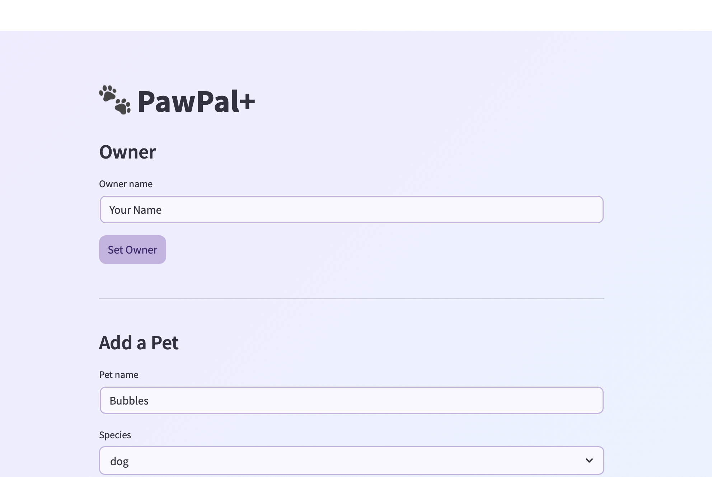
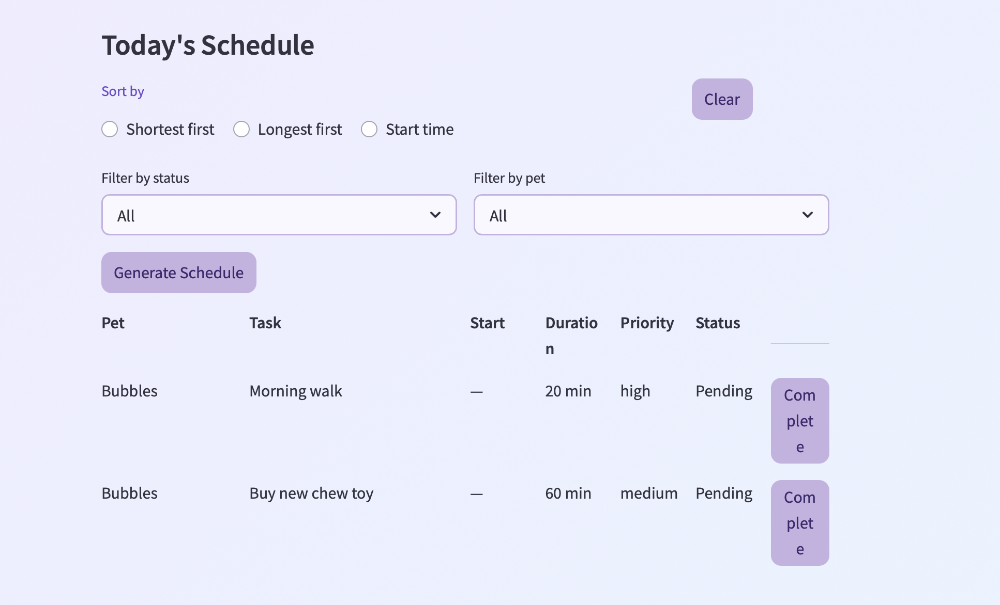

# PawPal+ (Module 2 Project)

You are building **PawPal+**, a Streamlit app that helps a pet owner plan care tasks for their pet.

## Scenario

A busy pet owner needs help staying consistent with pet care. They want an assistant that can:

- Track pet care tasks (walks, feeding, meds, enrichment, grooming, etc.)
- Consider constraints (time available, priority, owner preferences)
- Produce a daily plan and explain why it chose that plan

Your job is to design the system first (UML), then implement the logic in Python, then connect it to the Streamlit UI.

## What you will build

Your final app should:

- Let a user enter basic owner + pet info
- Let a user add/edit tasks (duration + priority at minimum)
- Generate a daily schedule/plan based on constraints and priorities
- Display the plan clearly (and ideally explain the reasoning)
- Include tests for the most important scheduling behaviors

## Getting started

### Setup

```bash
python -m venv .venv
source .venv/bin/activate  # Windows: .venv\Scripts\activate
pip install -r requirements.txt
```

### Suggested workflow

PawPal+ has many features!

Task — stores description, duration (minutes), priority (low/medium/high), frequency (once/daily/weekly), optional fixed start time, and completion status
Pet — holds a list of tasks; can retrieve only pending tasks
Owner — manages multiple pets; aggregates all tasks across them as flat tuples
Scheduler — manages multiple owners; traverses the full Scheduler → Owner → Pet → Task hierarchy to collect, filter, and sort tasks

Scheduling Logic
Fixed vs. floating tasks — tasks with a start_time are anchored; tasks without one are unscheduled and can be ordered by priority
Priority-based ordering — when no sort is selected, the schedule defaults to high → medium → low globally across all pets
Sort by duration — ascending (shortest first) or descending (longest first)
Sort by start time — chronological ordering using 12-hour AM/PM time parsing; tasks without a start time are pushed to the end
Conflict Detection
Time window overlap — uses the standard interval formula (start_a < end_b AND end_a > start_b) to detect collisions between any two fixed tasks
Cross-pet awareness — flags conflicts across different pets since one owner can only perform one task at a time; warning message names the owner and reason
Add-time validation — before a task is added in the UI, its window is checked against all existing fixed tasks; a warning is shown and the task is blocked if overlap is found
Recurrence
Auto-recreation on completion — marking a daily or weekly task complete automatically returns a new identical task (with completed=False) for the next occurrence
One-off tasks — tasks with frequency="once" return None on completion; no new task is created
Filtering
By status — show All, Pending only, or Completed only
By pet — filter the schedule down to a single pet or view all
UI (Streamlit)
Persistent state — owner, pets, and tasks survive page reruns via st.session_state
Inline complete button — per-task button marks complete and triggers recurrence if applicable
Conflict warnings — displayed as banners in the schedule view
Clear sort — radio selection can be reset to restore default priority ordering

Demo


